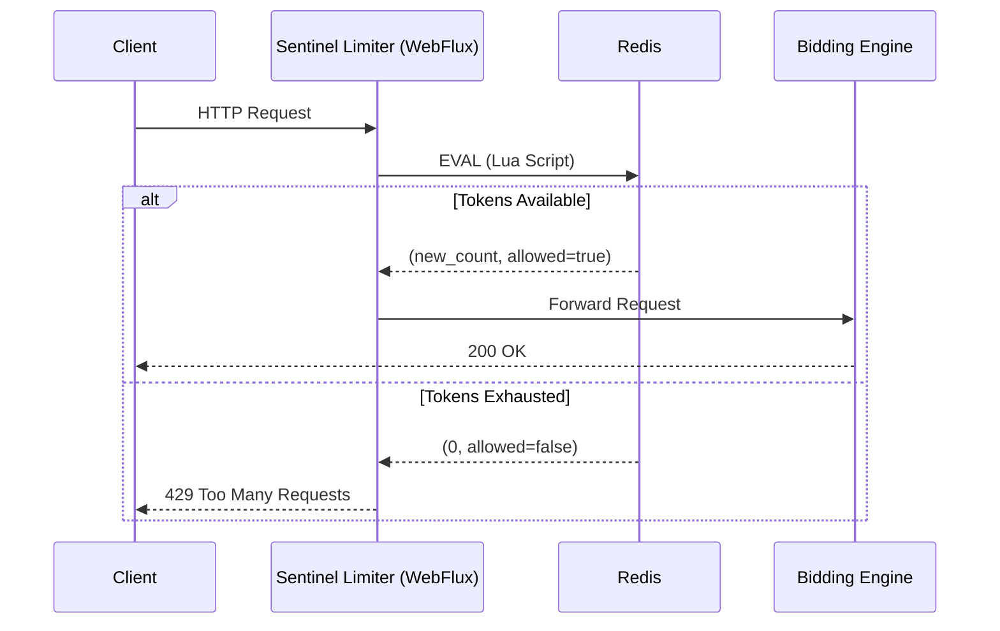

# Design Doc: Sentinel Limiter Service for Real-Time Bidding Engine

## 1. Context
* **Status:** Draft
* **Author:** Justin Walker
* **Date:** 02/14/2026

## 2. Problem Statement
To start the process of building our Bidding Engine, we need to ensure that requests are properly limited and spaced out
as to not overwhelm our server, while minimizing latency so that bids can be processed in "real time". 
There are two main concerns: 1) DoS attacks and 2) "Noisy Neighbor" attacks. 

DoS attacks are by far the bigger threat, as
they can crash the entire application and/or provide massive unfair advantages to malicious users. For instance, if a user 
causes the application to crash seconds before an auction is set to close, they can win the item at an unfairly low price
while shutting out competition from rule-abiding bidders. 

"Noisy Neighbor" attacks are less severe, but their effect can be 
extremely detrimental - one user using a 'bot' for spamming bids (perhaps, tiny increments multiple times a second) 
can shut out competition from rule-abiding users. 

To solve these two problems, we will give every user a 'budget' of requests
per second. Once they exceed this budget, their requests are dropped. To facilitate
the best possible performance while solving these problems, we will design the server to be a distributed system, with Redis
acting as the central "counter". The servers all consult Redis when they need to know the remaining bid 'tokens' a user has,
keeping an accurate global count for each user's limit. 

The focus will also be on minimizing latency, which we can also use 
Redis for - particularly, Redis Lua and Spring WebFlux. This is because every single request will carry the overhead of checking 
the counter. The goal will be keeping it under 5 ms. 

## 3. Goals and Non-Goals
* **Goal:** Enforce request limits per a) IP address (to thwart unauthenticated users/scraping bots) and b)
API key/UUID (to regulate competition and resource usage among authenticated sessions). 
* **Goal:** Make latency overhead for the slowest 1% of requests (P99 latency) to be < 5 ms. 
* **Goal:** Making metrics observable will be critical for monitoring performance - Micrometer will be used to count dropped
vs allowed requests, and Prometheus will scrape an Actuator endpoint every few seconds to obtain the latest metrics.
* **Goal:** In the event of a crash, the Limiter will default to allowing all requests (rather than blocking all users and
rendering the site inactive) to preserve continuity - there's no reason to visit a worst-case scenario upon ourselves just
because of a failure in the protection mechanism. 
* **Non-Goal:** User authentication will be handled by Gateway/Identity provider. We assume that validation/authentication
has been handled by the time a request reaches the Limiter. The Limiter is essentially a 'traffic light', not a 'security checkpoint'. 

## 4. Proposed Solution
* The Token Bucket Algorithm is perfectly suited for the task of regulating requests. 
* It will be implemented using Redis to keep track of each user's count (state) and Spring Webflux to further minimize 
latency by allowing non-blocking threads to execute (with concurrency largely handled by Spring's Virtual Threads).

### 4.1 Architecture Diagram 


### 4.2 Data Model (Redis)
* **Key:** ```rate_limit:{api_key}```
* **Value (Hash):** 
  * ```tokens```: Integer (current bucket depth)
  * ```last_refill```: Long (epoch timestamp) 

## 5. Security Considerations 
* **Race Conditions:**: Handled by Redis Lua Scripts, which provides atomicity to each request. Redis uses a single main event loop (
single-threaded), so we can use Lua scripting to facilitate "Get-Check-Decrement" logic server-side and provide blocking for 
the main event loop. This prevents TOCTOU ("Time of Check to Time of Use") race conditions where parallel requests could 
consume request tokens, even if the global count has reached 0. 
* **Redis VPC:** As Redis does not have much security, we must ensure that it is only accessible internally by the Sentinel
Limiter. To accomplish this, Redis will be deployed within a VPC (Virtual Private Cloud), or Private Subnet. It will have no 
public IP address and access will be controlled by security group rules. This prevents scanners such as Shodan from finding 
Redis and mounting attacks or implanting malicious code. 
